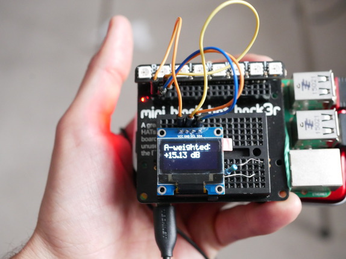

# RaspberryPi IOT Dosimeter / Sound Level Meter



This is a simple A-Weighted Dosimeter / Sound Level Meter for the RaspberryPi. It calculates 1s LAeq (uncalibrated), which is [A-weighted](https://en.wikipedia.org/wiki/A-weighting) average (RMS).

Inspired by [SuperShinyEyes/spl-meter-with-RPi](https://github.com/SuperShinyEyes/spl-meter-with-RPi)

Built in 4 hours.


# Parts List

- RaspberryPi 2B+ or newer
- Network connection (wifi or ethernet)
- 8gb+ SD-Card
- USB Soundcard ([ebay](https://www.ebay.com/sch/i.html?_nkw=3d+usb+sound+card&rt=nc&LH_All=1))
- Microphone ([ebay](https://www.ebay.com/sch/i.html?_nkw=lavalier+microphone+clip&rt=nc&LH_All=1))

## Optional

- SSD1306 (I2C) display. ([ebay](https://www.ebay.com/sch/i.html?_nkw=SSD1306+i2c&rt=nc&LH_All=1))
- Pimoromi Blinkt! RGB LED display ([Pimoromi](https://shop.pimoroni.com/products/blinkt))
- Pimoromi Mini Black HAT Hack3r ([Pimoromi](https://shop.pimoroni.com/products/mini-black-hat-hack3r))
- USB Battery Pack
- Download font from [here](https://www.dafont.com/pixelmix.font) & copy to ```src``` directory

# Setup

[Detailed guide](./setup/README.md)

1. Setup up hardware
2. Flash Memory card
3. Setup Raspbian
4. Copy SLM code over
5. Test Soundcard
6. Setup Crontab
7. Restart the RaspberryPi
8. ???
9. Profit

# TODO:

- Log the data into some kind of database / file
- Update bare exception handling.
- Multi-process the audio for A + C weighting
- Green -> Yellow -> Red colour scale
- Remote log the data
- Calibrate the mic / soundcard combo
